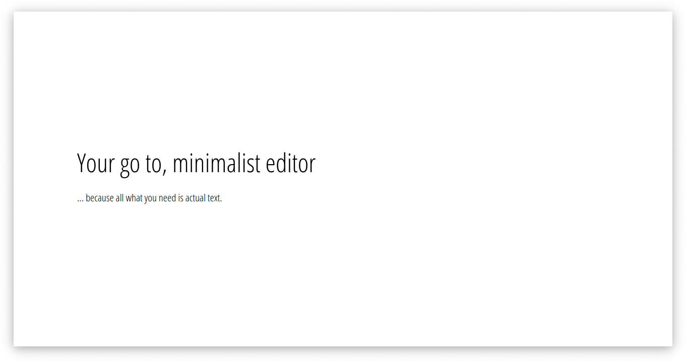

Kiji
==
Kiji (Writing in Japanese) is a minimalist, distraction-free editor.

I use this tool to write articles or taughts. You can write, close the window and go. Your text will be waiting for you when you comeback.

## Status
[DONE] This project is done and there is no intention to add new features to it. Please feel free to make a pull request if you want something new.